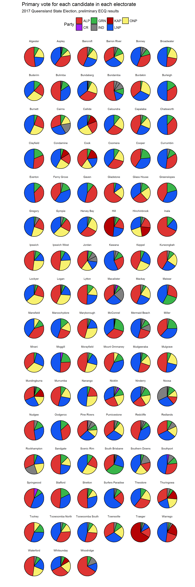

ECQ Primary Vote data
================

If you've run the ECQ scraper script you should have a file called `primary_votes.csv` in your `Data` folder. The scraper script pulls down the results pages from the [ECQ website](https://results.ecq.qld.gov.au/elections/state/State2017/results/summary.html) and extracts the results summary table for each electorate. I realise that there's a [downloadable zip file with an XML file](https://results.ecq.qld.gov.au/elections/state/State2017/mediainformation.html) but trying to deal with unzipping an XML and parsing the tree seemed to be too difficult. In any case, the HTML data is is all coerced into a tidy data frame with each candidate's party affiliation (`IND` if none given), raw number of formal, primary votes, and the percentage of the vote for that electorate received. A full distribution of preferences is not available yet.

``` r
# source("ecq_scraper.R")
library(tidyverse)
primary_votes <- read_csv("Data/primary_votes.csv")
head(primary_votes)
```

    ## # A tibble: 6 x 5
    ##           Candidate Party Votes Percent Electorate
    ##               <chr> <chr> <dbl>   <dbl>      <chr>
    ## 1    LANYON, Darryl   ONP  4963   18.17   Algester
    ## 2 PATTISON, Clinton   LNP  5916   21.65   Algester
    ## 3    ENOCH, Leeanne   ALP 14219   52.04   Algester
    ## 4    O'BRIEN, Patsy   GRN  2223    8.14   Algester
    ## 5     MELLISH, Bart   ALP 11600   37.50     Aspley
    ## 6     HANSEN, James   GRN  2871    9.28     Aspley

We need to choose some colours for each party running. These are taken from the [Wikipedia template](https://en.wikipedia.org/wiki/Category:Australia_political_party_colour_templates) except for `CR`, the Consumer Rights & No-Tolls party.

``` r
cols <- unlist(list(ALP = "#DE3533",
                    GRN = "#39b54a",
                    LNP = "#1456F1",
                    IND = "#808080",
                    KAP = "#b50204",
                    ONP = "#F8F16F",
                    CR = "purple"))
```

We also need to process the data to show who is independent, and to order the candidates from largest to smallest vote (with 1 being the largest vote)

``` r
to_plot <- mutate(primary_votes, 
                  Party = if_else(is.na(Party), 
                                  "IND", 
                                  Party)) %>%
  group_by(Electorate) %>%
  arrange(desc(Percent)) %>%
  mutate(order = 1:n()) %>%
  arrange(Electorate, order)
```

Now consider all electorates shown as pie charts, with candidates ordered by share of vote

``` r
ggplot(data=to_plot,
       aes(x=0, y=Percent)) + 
  geom_col(aes(fill=Party, group=order), 
           position=position_stack(),
           color="black") +
  coord_polar(theta = "y") +
  facet_wrap( ~ Electorate, nrow=16) +
  theme_minimal() + 
  theme(legend.position="top", axis.text = element_blank(), 
        strip.text = element_text(size=7),
        panel.grid = element_blank()) +
  scale_fill_manual(values = cols) +
  xlab("") + ylab("") +
  ggtitle(label = "Primary vote for each candidate in each electorate",
          subtitle = "2017 Queensland State Election, preliminary ECQ results")
```


